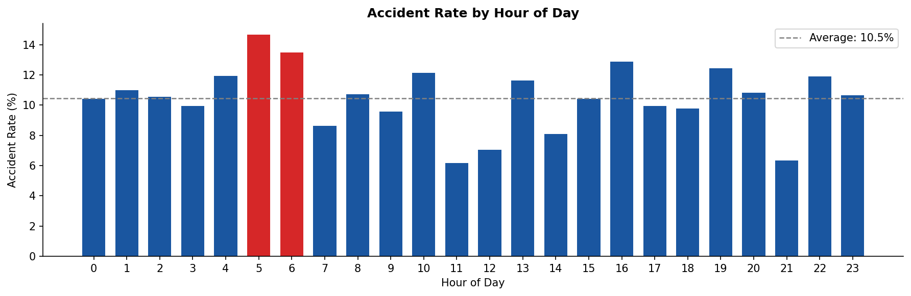
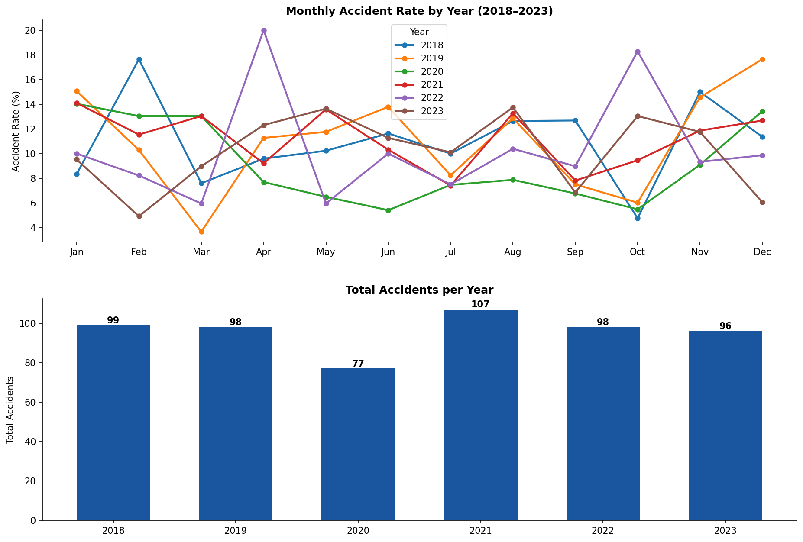
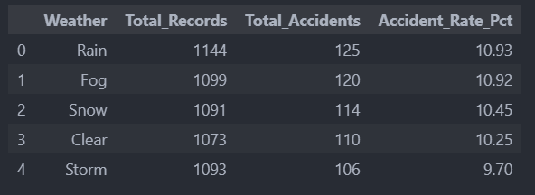
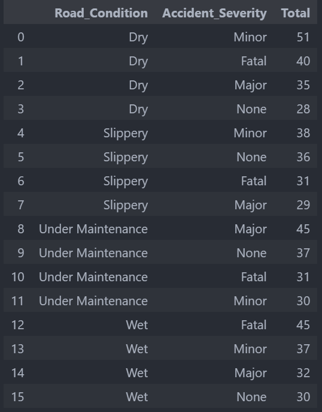
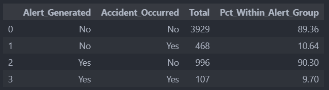
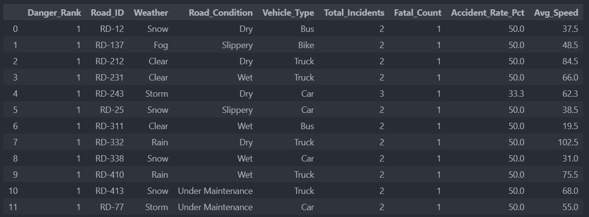

# Transportation Accident Analysis
**Tools :** Python · SQL (SQLite) · Pandas · Matplotlib  
**Dataset :** [Kaggle](https://www.kaggle.com/datasets/kundanbedmutha/transportation-and-accident-prediction-dataset)

[View Notebook](notebooks/Notebook.ipynb) &nbsp;|&nbsp; [View Charts](./output/)

---

## Project Background

This project analyzes a multiyear transportation dataset covering 5,500 incident records across 2018–2023. The dataset includes variables such as weather conditions, road quality, vehicle type, time of incident, and whether an early warning alert was triggered.

The goal is to identify patterns in accident occurrence and severity, also to practice translating raw traffic data into decisions that could realistically improve road safety operations.

Analysis covers four key areas:
- **Timing patterns** — when accidents are most likely to occur
- **Environmental conditions** — the role of weather and road quality
- **Alert system effectiveness** — does the early warning system actually help?
- **High risk combinations** — which factors together produce the worst outcomes

SQL queries used for data exploration and cleaning can be found 
[here](notebooks/cleaning.ipynb).

---

## Data Structure & Initial Checks

The dataset contains **5,500 records** and **17 columns**, covering incident data from January 2018 to December 2023.

| Column | Description |
|--------|-------------|
| `Timestamp` | Date and time of incident |
| `Vehicle_Type` | Car, Truck, Motorcycle, Bus |
| `Weather` | Clear, Rain, Fog, Snow, Storm |
| `Road_Condition` | Dry, Wet, Slippery, Under Maintenance |
| `Traffic_Density` | Low, Medium, High |
| `Avg_Speed_kmh` | Average vehicle speed at time of incident |
| `Accident_Occurred` | Yes / No |
| `Accident_Severity` | Fatal, Major, Minor, None |
| `Alert_Generated` | Whether an early warning alert was triggered |

**Initial checks performed :**
- No missing values found across all 17 columns
- No duplicate rows
- `Timestamp` column re-parsed from string to datetime format
- `Accident_Severity` null equivalent values standardized from `"-"` to `"None"`
- New columns extracted: `Year`, `Month`, `Hour`, `DayOfWeek`

---

## Executive Summary

Accident risk in this dataset is clusters around specific times, conditions, and vehicle types.
The 3 most important findings : 
**early morning hours (05:00–06:00) show the highest accident rates at over 13%**, wet roads disproportionately produce fatal outcomes, and the current alert system only reduces accident rate by roughly 1% (suggesting it needs significant improvement before it can be considered a reliable safety mechanism). 

---

## Insights Deep Dive

### Timing Patterns

- **05:00–06:00 is the most dangerous window**, with an accident rate nearly double the safest hours (above 13%). Low visibility, driver fatigue, and early traffic build up likely combine during this window.
- **11:00 and 21:00 are the safest hours**, both sitting below 7% accident rate.
- Rush hour (07:00–09:00) shows moderate but not peak risk.

  

- No single month is consistently dangerous across all years, suggesting timing risk is more time-of-day than seasonal.

  

### Environmental Conditions

- **Rain and Fog show the highest accident rates** (~10.9%), though the difference between weather types is small.

  

- **Wet roads produce the most Fatal accidents** in absolute terms, while Under Maintenance roads lead in Major severity incidents.
- Dry roads, despite feeling safer, are associated with higher average speeds which may offset the traction advantage.

  

### Alert System Effectiveness

- When an alert was triggered, accident rate dropped from **10.64% to 9.70%** (a reduction of less than 1 percentage point).
- This means roughly **9 out of 10 alerted situations still result in no accident** regardless of the alert. 
- The current alert mechanism shows potential but is not yet a reliable prevention tool.

  

### High Risk Combinations

- Using CTE and window functions, the analysis ranked road–weather–vehicle combinations by fatal incident count.
- **Trucks on wet roads** appear most frequently in the top risk combinations, particularly at above average speeds.
- Slippery road conditions paired with any vehicle type consistently rank higher than dry conditions at equivalent speeds.

  

---

## Recommendations

- **Strengthen monitoring at 05:00–06:00.** This window consistently shows the highest accident rates. Increased patrol presence or speed enforcement during these hours could have meaningful impact.

- **Prioritize wet and under-maintenance road interventions.** These conditions are disproportionately linked to fatal and major outcomes. 

- **Revisit the alert system design.** A ~1% reduction in accident rate suggests the alert is either not reaching drivers in time, not being acted upon, or triggered too broadly. A more targeted, context aware alert system is worth exploring.

- **Apply stricter speed regulation for heavy vehicles in hazardous conditions.** Trucks on wet or slippery roads appear repeatedly in highrisk combinations. So a targeted policy could reduce the most severe outcomes.

---

## Assumptions and Caveats

- **This dataset is synthetically generated.** Patterns are more uniform than real world traffic data would produce. All findings should be treated as methodological demonstrations, not operational conclusions.
- **No geospatial or route context.** The dataset includes coordinates but no road network information, so accident clusters cannot be mapped to specific corridors or intersections.
- **Correlation, not causation.** The alert effectiveness finding (~1% reduction) does not establish a causal relationship, other variables may explain the difference.
